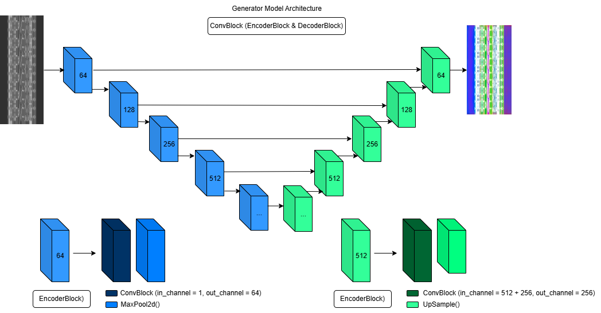
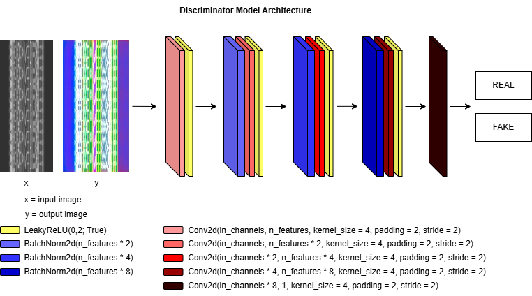
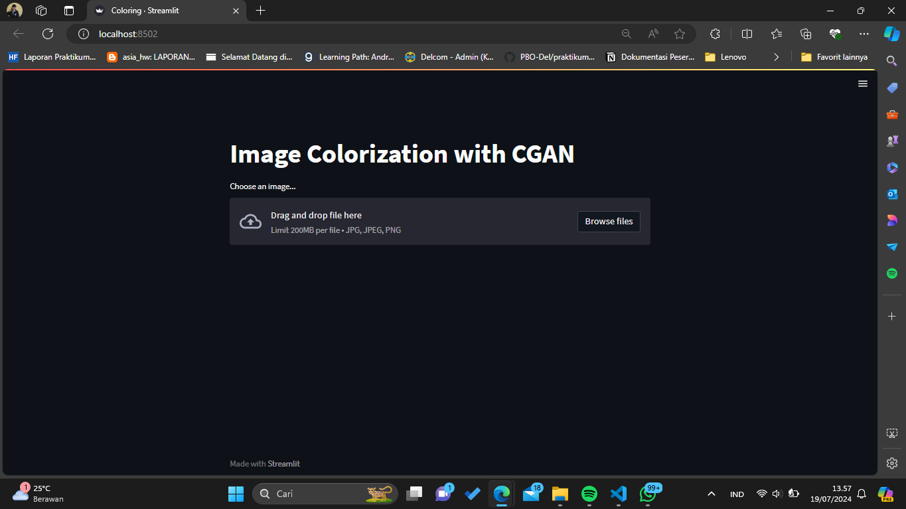

# Automatic Coloring Method for Ulos Motifs Based on Generative Adversarial Networks
## Research Team
Supervisor:
1. Dr. Arlinta Christy Barus S.T., M.InfoTech.
2. Samuel Indra Gunawan Situmeang, S.TI., M.Sc.

Student
1. 11S20003 Reinhard Hottua Simbolon
2. 11S20046 Rachel Riris Rotua Damanik
3. 11S20048 Theresia Yolanda Laura Hutabarat

## Overview
This repository contains code and resources for research projects that use the CGAN algorithm. The main goal is to carry out automatic coloring of ulos motifs.

## CGAN Model Architecture

### Generator Model
UNet model was used as a generator. It takes image as an input. To randomize output of generator, dropout layers applied both at training and evalutaion time as a noise.
1. **Convolutional Block with Residual Connection**: The **ConvBlock** class extends **nn.Module** and implements a convolutional block with a residual connection, typically used in modern deep learning architectures like ResNets.
2. **Encoder and Decoder Blocks in a Neural Network**: The **EncoderBlock** and **DecoderBlock** are fundamental components used in the architecture of autoencoders and U-Nets, typically used in tasks like image segmentation. 
The Encoder and Decoder blocks are crucial for building deep learning models that require precise spatial transformations, such as in image segmentation where detailed spatial resolution is necessary for accurate pixel-level predictions.
3. **U-Net Architecture Implementation**: The **UNet** class implements a U-Net architecture, a popular model for biomedical image segmentation that features a symmetric encoder-decoder structure.
The U-Net architecture effectively combines high-level feature extraction with precise localization, facilitated by skip connections that help in transferring spatial information to the decoder. This structure makes it particularly effective for tasks where precise segmentation is crucial.

### Diskriminator Model
Due to our input image shape **batch_size x 3 x 256 x 128**, in out PatchGAN discriminator we have 3 sequential **3 x 3** conv. **PatchGAN Network Architecture**, The **PatchGAN** class defines a convolutional neural network specifically designed for processing patches of images, commonly used in tasks such as image segmentation and texture synthesis. This model architecture is particularly effective in applications where local texture patterns are crucial, such as in style transfer and local image editing.
PatchGAN can be used in various applications within computer vision, particularly in generative adversarial networks (GANs) where the model needs to discriminate between real and synthetic images at the scale of image patches, thus enabling detailed texture and pattern discrimination.

#### PatchGAN Model
The **PatchGAN** model is initialized with three input channels and configured to process images such as those in RGB format. The model is then moved to a computational device (CPU or GPU) for efficient processing. Here is an explanation of each step:

1. ##### Model Initialization and Device Allocation:
- **PatchGAN(in_channels=3)**: Constructs a **PatchGAN** model that accepts images with three channels (RGB). This model is particularly used in applications like image synthesis or segmentation where understanding local patches is crucial.
- **.to(device)**: This method transfers the model to a specified device (**cpu** or **gpu**). This is essential for leveraging hardware acceleration during training or inference, enhancing performance and efficiency.

2. ##### Model Summary with torchsummary:
- **summary(D, [(1, image_size[0], image_size[1]), (2, image_size[0], image_size[1])])**: Provides a detailed summary of the model. The summary includes layer-by-layer details, output shapes, and the number of parameters at each stage.
  - The parameters for the **summary** function indicate the size of the input tensors:
    - The first input tensor, with 1 channel and dimensions defined by **image_size**, could represent a specific feature map or modality.
    - The second input tensor, with 2 channels and the same spatial dimensions, might carry additional contextual or conditional information influencing the network's predictions.

3. #### Practical Application:
This initialization and summary are particularly valuable for developers and researchers:
- **Model Development**: Understanding the internal architecture, including the flow and transformation of data through the network, is crucial during the development and debugging phases.
- **Resource Management**: Insight into parameter count and memory usage helps in optimizing the model for different computational environments, ensuring efficient deployment.

## Model Interface

## Demo
Check out the video demo of the model below:

   

---

*© Informatics Study Program, Faculty of Informatics and Electrical Engineering, Institut Teknologi Del, 2024*

---

## `😚 Spread the word!`
If the information from this repo was useful to you in any way, make sure you give it a star 🌟, this way others can find it and benefit too!

**Do you have any suggestions on how we could improve this project overall? Let us know! We'd love to hear your feedback!❤️**